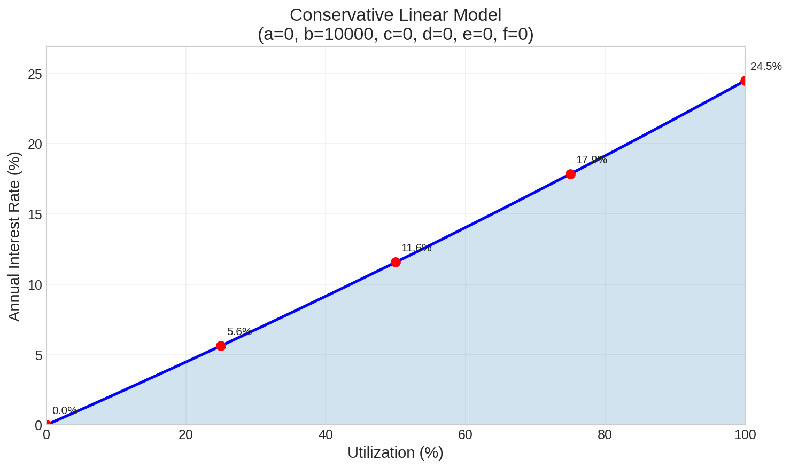
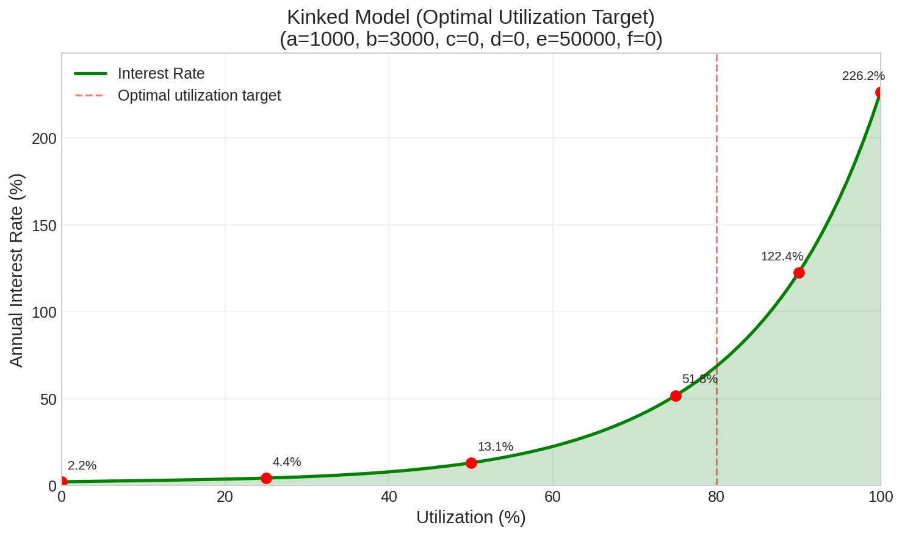
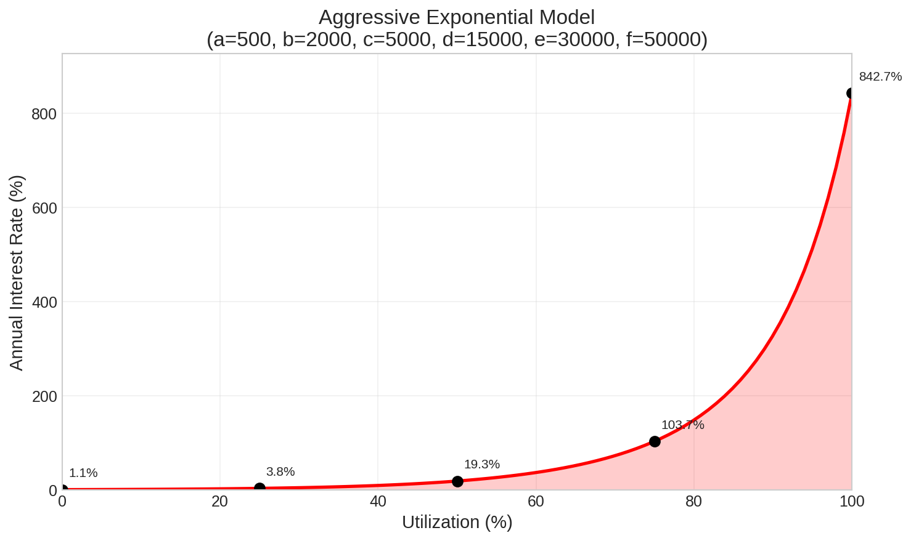
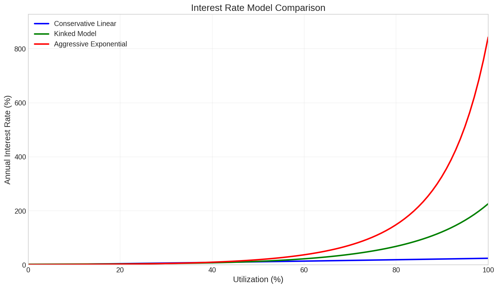
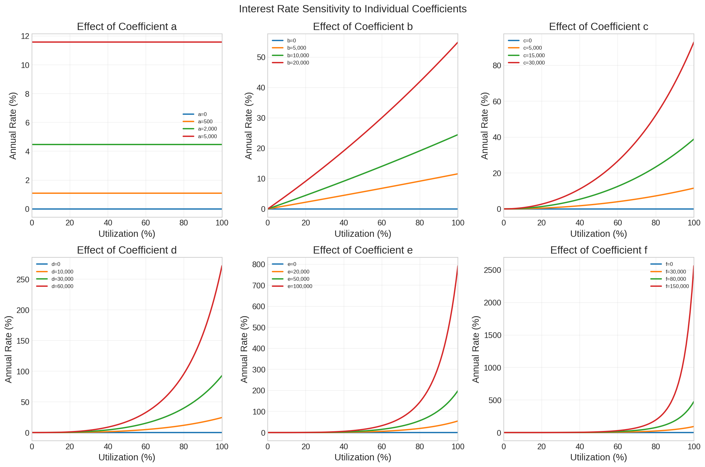

# Example 1: Compound Interest Implementation

## Overview

This implementation uses a **polynomial interest rate model** that compounds interest at regular intervals. The interest rate is dynamically calculated based on pool utilization, with configurable coefficients read from an external parameter box. This allows governance to adjust interest rate curves without redeploying the interest contract.

---

## Architecture

### Contract Dependencies

| Dependency | Purpose |
|------------|---------|
| Pool Box (data input) | Provides current utilization data |
| Parameter Box (data input) | Provides polynomial coefficients |

### Token Requirements

| Token | Description |
|-------|-------------|
| `tokens(0)` | Interest NFT (unique identifier) |

### Register Layout

| Register | Type | Description |
|----------|------|-------------|
| R4 | `Long` | Last update height (block number) |
| R5 | `BigInt` | Current borrow token value |
| R6-R9 | `Boolean` | Reserved (dummy registers) |

---

## Interest Rate Model

### Polynomial Formula

The interest rate per period is calculated using a 5th-degree polynomial function of utilization:
```
rate(u) = 1 + a + b·u + c·u² + d·u³ + e·u⁴ + f·u⁵
```

Where:
- `u` = utilization ratio (0 to 1, scaled by InterestDenomination)
- `a, b, c, d, e, f` = configurable coefficients from parameter box
- All coefficients are scaled by `CoefficientDenomination` (10^8)

### Utilization Calculation
```scala
val borrowed = borrowTokens * recordedValue / BorrowTokenDenomination
val util = InterestDenomination * borrowed / (poolAssets + borrowed)
```

Utilization ranges from 0 (no borrows) to `InterestDenomination` (100% utilized).

### Value Update

Each update period, the borrow token value compounds:
```scala
val validValueUpdate = finalValue == recordedValue * currentRate / InterestDenomination
```

---

## Constants

| Constant | Value | Description |
|----------|-------|-------------|
| `InterestDenomination` | 100,000,000 (10^8) | Scale factor for utilization and rates |
| `BorrowTokenDenomination` | 10,000,000,000,000,000 (10^16) | Scale factor for borrow token values |
| `CoefficientDenomination` | 100,000,000 (10^8) | Scale factor for polynomial coefficients |
| `updateFrequency` | 120 | Blocks between interest updates (~4 hours) |
| `MaximumExecutionFee` | 2,000,000 | Maximum ERG for update transaction fee |

---

## Parameter Box Interface

### Location

The parameter box is identified by a hardcoded NFT:
```scala
val InterestParamaterBoxNft = fromBase58("{interestParamNFT}")
val parameterBox = CONTEXT.dataInputs(1)
val validParameterBox = parameterBox.tokens(0)._1 == InterestParamaterBoxNft
```

### R4: Coefficients (`Coll[Long]`) — REQUIRED

| Index | Coefficient | Description |
|-------|-------------|-------------|
| 0 | `a` | Constant term (base rate) |
| 1 | `b` | Linear coefficient |
| 2 | `c` | Quadratic coefficient |
| 3 | `d` | Cubic coefficient |
| 4 | `e` | Quartic coefficient |
| 5 | `f` | Quintic coefficient |

---

## Interest Rate Curves

### Annualization

With 120-block update periods (~4 hours assuming 2-minute blocks):
- Updates per year ≈ 2,190
- Annual rate = (period rate)^2190

### Example Parameter Sets

#### Conservative Linear Model

**Coefficients:** `a=0, b=10000, c=0, d=0, e=0, f=0`

This model provides a simple linear relationship between utilization and interest rate, ranging from 0% APR at 0% utilization to approximately 24.5% APR at 100% utilization.



| Utilization | Annual Rate |
|-------------|-------------|
| 0% | 0.0% |
| 25% | 5.6% |
| 50% | 11.6% |
| 75% | 17.9% |
| 100% | 24.5% |

---

#### Kinked Model (Optimal Utilization Target)

**Coefficients:** `a=1000, b=3000, c=0, d=0, e=50000, f=0`

This model creates a gentle slope up to the optimal utilization target (~80%), then a steep increase to discourage over-utilization. The quartic coefficient (e) creates the "kink" effect.



| Utilization | Annual Rate |
|-------------|-------------|
| 0% | 2.2% |
| 25% | 4.4% |
| 50% | 13.1% |
| 75% | 51.8% |
| 90% | 122.4% |
| 100% | 226.2% |

---

#### Aggressive Exponential Model

**Coefficients:** `a=500, b=2000, c=5000, d=15000, e=30000, f=50000`

This model uses all polynomial terms to create an exponential-like curve that starts low but rises steeply at high utilization, strongly discouraging full pool utilization.



| Utilization | Annual Rate |
|-------------|-------------|
| 0% | 1.1% |
| 25% | 3.1% |
| 50% | 17.5% |
| 75% | 100.7% |
| 100% | 843.1% |

---

### Model Comparison

The following chart compares all three models to illustrate how different coefficient configurations affect the interest rate curve:



---

## Coefficient Sensitivity Analysis

Each coefficient affects the interest rate curve differently based on its polynomial degree:

- **Coefficient a (constant)**: Adds a flat base rate regardless of utilization
- **Coefficient b (linear)**: Creates a proportional increase with utilization
- **Coefficient c (quadratic)**: Adds curvature that accelerates at higher utilization
- **Coefficient d (cubic)**: Creates stronger acceleration at high utilization
- **Coefficient e (quartic)**: Enables "kink" effects for utilization targeting
- **Coefficient f (quintic)**: Extreme acceleration at very high utilization



---

## Update Mechanism

### Trigger Conditions
```scala
val isReadyToUpdate = HEIGHT >= recordedHeight
val validFinalHeight = finalHeight == recordedHeight + updateFrequency
```

Updates can only occur after the previous update period has elapsed.

### State Transition

1. Read current pool utilization from Pool box (data input)
2. Read coefficients from Parameter box (data input)
3. Calculate interest rate using polynomial formula
4. Multiply current `borrowTokenValue` by rate
5. Update height register to `currentHeight + updateFrequency`

### Validation Requirements
```scala
val validSuccessorScript = SELF.propositionBytes == successor.propositionBytes
val retainedERG = successor.value >= SELF.value - MaximumExecutionFee
val preservedInterestNFT = successor.tokens == SELF.tokens
val validPoolBox = pool.tokens(0)._1 == PoolNft
val validParameterBox = parameterBox.tokens(0)._1 == InterestParamaterBoxNft
```

---

## Governance

### Adjustable Parameters

The polynomial coefficients can be modified by updating the Parameter box, allowing governance to:

1. **Adjust base rates**: Modify coefficient `a`
2. **Change rate sensitivity**: Modify coefficients `b` through `f`
3. **Create utilization targets**: Shape the curve to encourage optimal utilization
4. **Respond to market conditions**: Increase rates during high demand

### Parameter Update Process

1. Create new Parameter box with updated R4 coefficients
2. Parameter box contract controls who can make updates
3. Interest contract automatically uses new coefficients on next update

---

## Security Considerations

1. **Update Frequency**: 120 blocks provides balance between accuracy and transaction costs
2. **Coefficient Bounds**: Extreme coefficients could cause overflow or excessive rates
3. **Utilization Edge Cases**: Formula handles 0% and 100% utilization correctly
4. **Data Input Validation**: Both Pool and Parameter boxes are validated by NFT

---

## Implementation Checklist

- [ ] Interest NFT minted and held in contract box
- [ ] R4 initialized to genesis block height
- [ ] R5 initialized to `BorrowTokenDenomination` (10^16)
- [ ] Parameter box deployed with initial coefficients
- [ ] Parameter box NFT hardcoded in interest contract
- [ ] Pool NFT hardcoded in interest contract
- [ ] Update bot configured to trigger updates every 120 blocks
- [ ] Coefficient bounds validated in parameter box contract

---

## Note: Simple Interest Variant

To convert this implementation to **simple (non-compounding) interest**, change the value update formula from multiplication to addition:

**Compound (current):**
```scala
val validValueUpdate = finalValue == recordedValue * currentRate / InterestDenomination
```

**Simple:**
```scala
val validValueUpdate = finalValue == recordedValue + (BorrowTokenDenomination * currentRate / InterestDenomination)
```

With simple interest, each update adds a fixed increment based on the original denomination rather than multiplying the current value. The interest earned does not itself earn interest in subsequent periods.
