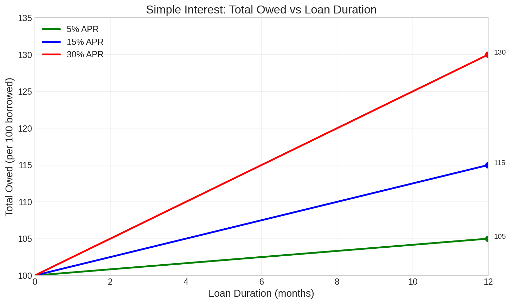
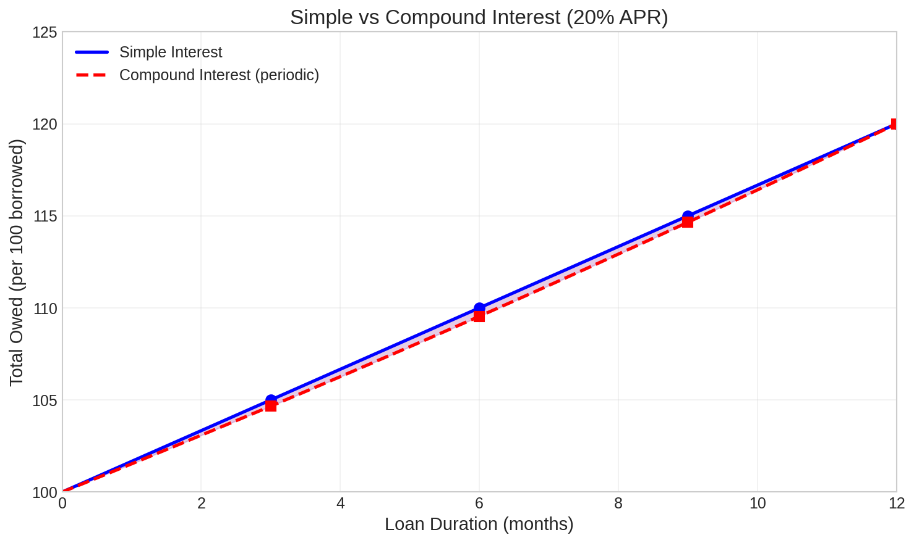

# Example 2: Simple Interest Implementation

## Overview

This implementation uses a **simple (non-compounding) interest model** where interest accrues linearly based on time elapsed since the loan originated. Instead of periodically updating a global borrow token value, each loan's interest is calculated at the time of repayment or liquidation based on the duration of the loan.

---

## Architecture

### Key Differences from Compound Model

| Aspect | Compound Model | Simple Interest Model |
|--------|----------------|----------------------|
| Interest accrual | Periodic global updates | Calculated per-loan at settlement |
| Borrow token value | Changes over time | Fixed at 1:1 with pool currency |
| Update transactions | Required every period | Not required |
| Gas costs | Ongoing update costs | Zero maintenance costs |
| Interest calculation | Global rate applies to all | Per-loan based on duration |

### Token Requirements

| Token | Description |
|-------|-------------|
| `tokens(0)` | Interest NFT (unique identifier) |

### Register Layout

| Register | Type | Description |
|----------|------|-------------|
| R4 | `Long` | Annual interest rate (scaled by RateDenomination) |
| R5 | `BigInt` | Fixed value: `BorrowTokenDenomination` (always 10^16) |
| R6-R9 | `Boolean` | Reserved (dummy registers) |

---

## Interest Rate Model

### Simple Interest Formula

Interest is calculated linearly based on loan duration:

```
interest = principal × rate × (currentHeight - borrowHeight) / blocksPerYear
```

Where:
- `principal` = original loan amount in pool currency
- `rate` = annual interest rate from R4
- `currentHeight` = current block height
- `borrowHeight` = block height when loan was created (stored in collateral R9)
- `blocksPerYear` ≈ 262,800 (assuming 2-minute blocks)

### Total Owed Calculation

```
totalOwed = principal + interest
         = principal × (1 + rate × duration / blocksPerYear)
```

---

## Constants

| Constant | Value | Description |
|----------|-------|-------------|
| `RateDenomination` | 1,000,000 (10^6) | Scale factor for interest rate |
| `BorrowTokenDenomination` | 10,000,000,000,000,000 (10^16) | Scale factor (fixed) |
| `BlocksPerYear` | 262,800 | Approximate blocks in one year |

---

## Contract Implementation

### Interest Box (Simplified)

```scala
{
    val InterestNFT = SELF.tokens(0)._1
    val RateDenomination = 1000000L
    
    val successor = OUTPUTS(0)
    
    val currentRate = SELF.R4[Long].get
    val currentValue = SELF.R5[BigInt].get  // Always BorrowTokenDenomination
    
    val finalRate = successor.R4[Long].get
    val finalValue = successor.R5[BigInt].get
    
    // Value never changes - it's always 1:1
    val valuePreserved = finalValue == currentValue
    
    // Rate can only be changed by governance
    val validRateChange = {
        // Governance signature or multisig required
        proveDlog(governancePK)
    }
    
    val scriptPreserved = successor.propositionBytes == SELF.propositionBytes
    val nftPreserved = successor.tokens(0) == SELF.tokens(0)
    
    sigmaProp(
        scriptPreserved &&
        nftPreserved &&
        valuePreserved
    ) && validRateChange
}
```

### Modified Collateral Contract Debt Calculation

The collateral contract must calculate interest based on loan duration:

```scala
// Constants
val InterestNFT = fromBase58("{interestNft}")
val BorrowTokenDenomination = 10000000000000000L.toBigInt
val RateDenomination = 1000000L
val BlocksPerYear = 262800L

// Get interest rate from interest box
val interestBox = CONTEXT.dataInputs.filter{
    (b: Box) => b.tokens.size > 0 && b.tokens(0)._1 == InterestNFT
}(0)
val annualRate = interestBox.R4[Long].get

// Loan parameters from collateral box
val loanAmount = currentBorrowTokens._2
val borrowHeight = iLoanSettings(5)  // Height when loan was created

// Calculate simple interest
val principal = loanAmount.toBigInt * BorrowTokenDenomination / BorrowTokenDenomination  // 1:1 ratio
val duration = HEIGHT - borrowHeight
val interest = principal * annualRate.toBigInt * duration.toBigInt / (RateDenomination.toBigInt * BlocksPerYear.toBigInt)

val totalOwed = principal + interest
```

---

## Interest Rate Examples

### Total Owed vs Loan Duration

The following chart shows how the total owed grows linearly over time for different APR rates:



### Fixed Rate Scenarios

#### Low Rate: 5% Annual

**R4 value:** `50000` (50000 / 1000000 = 0.05 = 5%)

| Duration | Interest | Total Owed (per 100 borrowed) |
|----------|----------|------------------------------|
| 1 month | 0.42% | 100.42 |
| 3 months | 1.25% | 101.25 |
| 6 months | 2.50% | 102.50 |
| 12 months | 5.00% | 105.00 |

#### Medium Rate: 15% Annual

**R4 value:** `150000` (150000 / 1000000 = 0.15 = 15%)

| Duration | Interest | Total Owed (per 100 borrowed) |
|----------|----------|------------------------------|
| 1 month | 1.25% | 101.25 |
| 3 months | 3.75% | 103.75 |
| 6 months | 7.50% | 107.50 |
| 12 months | 15.00% | 115.00 |

#### High Rate: 30% Annual

**R4 value:** `300000` (300000 / 1000000 = 0.30 = 30%)

| Duration | Interest | Total Owed (per 100 borrowed) |
|----------|----------|------------------------------|
| 1 month | 2.50% | 102.50 |
| 3 months | 7.50% | 107.50 |
| 6 months | 15.00% | 115.00 |
| 12 months | 30.00% | 130.00 |

---

## Comparison: Simple vs Compound Interest

### 1-Year Loan at 20% Rate

The following chart compares simple and compound interest models at the same 20% APR:



**Key Observations:**

- Simple interest (blue solid line) grows linearly
- Compound interest (red dashed line) follows an exponential curve
- For periods less than 1 year, simple interest actually results in slightly **higher** total owed
- Both converge to the same value at exactly 1 year (the definition point of APR)

| Duration | Simple (20% APR) | Compound (20% APR) | Difference |
|----------|------------------|-------------------|------------|
| 3 months | 105.00 | 104.66 | +0.34 |
| 6 months | 110.00 | 109.54 | +0.46 |
| 9 months | 115.00 | 114.65 | +0.35 |
| 12 months | 120.00 | 120.00 | 0.00 |

*Note: This comparison uses the same APR (Annual Percentage Rate) for both models. The difference arises because APR is defined at the 1-year mark.*

---

## Governance

### Rate Adjustment

The interest rate can be adjusted by updating R4 in the interest box:

1. Governance proposes new rate
2. Transaction updates R4 with governance signature
3. New rate applies to all future interest calculations
4. Existing loans continue accruing at the current rate based on their duration

### Rate Bounds

Recommended constraints in the interest contract:

```scala
val validRate = finalRate >= 0 && finalRate <= 1000000  // 0% to 100% max
```

---

## Advantages

1. **No Maintenance**: No periodic update transactions required
2. **Predictable**: Borrowers know exact interest from the start
3. **Gas Efficient**: Zero ongoing operational costs
4. **Simple Auditing**: Easy to verify interest calculations
5. **Transparent**: Interest accrual is deterministic and verifiable

## Disadvantages

1. **No Utilization Response**: Rate doesn't automatically adjust to market conditions
2. **Manual Governance**: Rate changes require explicit governance action
3. **Less Capital Efficient**: Cannot incentivize optimal utilization dynamically
4. **Arbitrage Risk**: Fixed rates may become mispriced relative to market

---

## Security Considerations

1. **Duration Overflow**: Ensure duration calculations don't overflow for very old loans
2. **Rate Bounds**: Constrain maximum rate to prevent excessive interest
3. **Height Validation**: Verify `borrowHeight` is not in the future
4. **Governance Security**: Rate changes should require appropriate authorization

---

## Implementation Checklist

- [ ] Interest NFT minted and held in contract box
- [ ] R4 initialized with desired annual rate (scaled by 10^6)
- [ ] R5 initialized to `BorrowTokenDenomination` (10^16) - never changes
- [ ] Collateral contract modified to calculate duration-based interest
- [ ] Pool contract updated to use 1:1 borrow token ratio
- [ ] Governance mechanism defined for rate adjustments
- [ ] Rate bounds validated in contract
- [ ] Duration overflow protection implemented

---

## Migration Considerations

If migrating from compound to simple interest:

1. **Existing Loans**: Must decide whether to grandfather existing loans or convert
2. **Borrow Token Value**: Existing loans have accumulated interest in borrow token value
3. **Collateral Contract**: Requires redeployment with new interest calculation logic
4. **Pool Contract**: May need updates to handle fixed borrow token values
